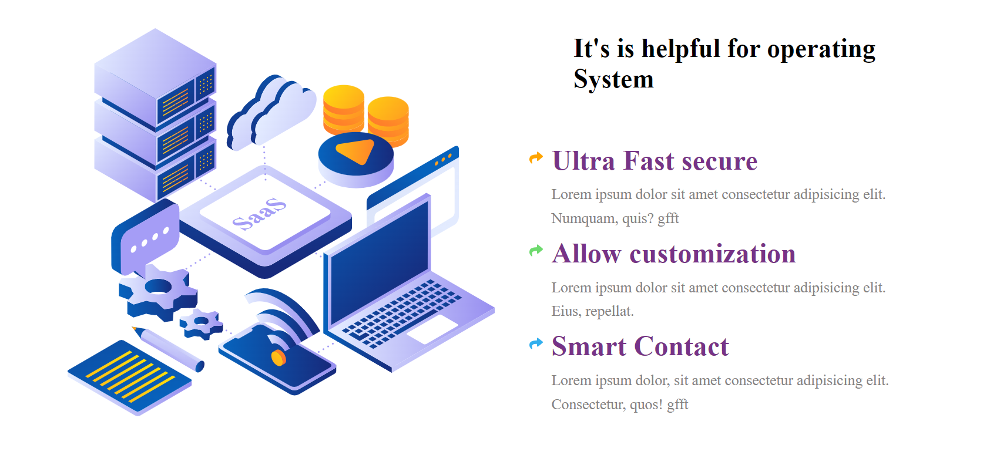
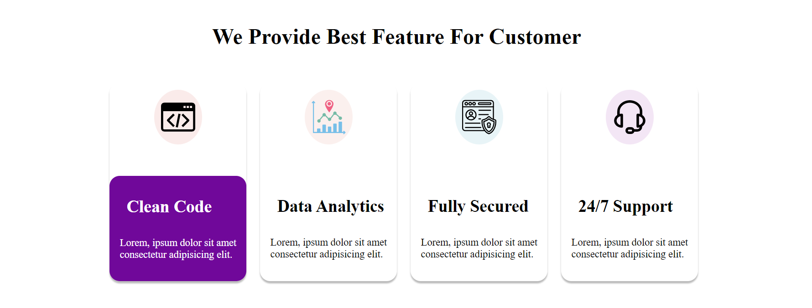

# Project13(HTML & CSS)

# Learnings from this project:

- Learnt about  -webkit-text-stroke-width 
   and  -webkit-text-stroke-color

- Learnt about drawing required Shapes in the span element.

## Time taken: 3 hours

# Web Page : [Live-Link](https://project13-htmlcss.netlify.app/)

